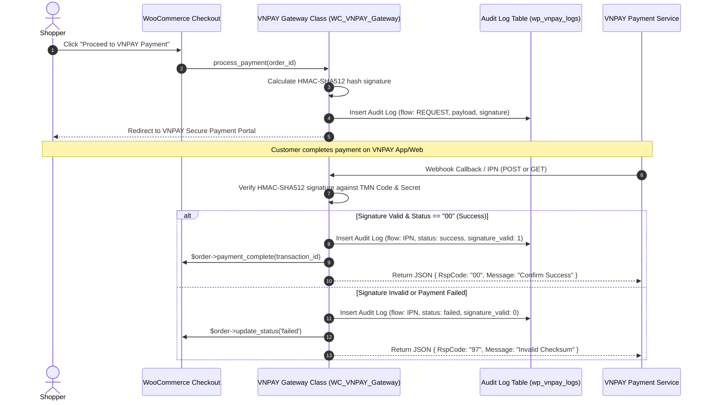

# VNPAY Payment Gateway for WooCommerce

> **WooCommerce High-Performance Order Storage (HPOS) Compatible Payment Gateway**  
> *A production-ready custom WooCommerce payment gateway plugin for VNPAY featuring HMAC-SHA512 checksum validation, custom audit logging tables, and scheduled log retention jobs.*

[](https://woocommerce.com)
[](https://wordpress.org)
[](https://php.net)
[](https://vnpay.vn)

---

## 📌 Technical Motivation

VNPAY is the dominant payment gateway in Vietnam (supporting QR Pay, ATM cards, and credit cards). Traditional payment gateway plugins often lack compatibility with WooCommerce **High-Performance Order Storage (HPOS)** or fail to maintain audit logs for failed transaction callbacks.

**VNPAY Payment Gateway for WooCommerce** is an **independent custom plugin** engineered to deliver secure, HPOS-compatible payment processing with a dedicated MySQL audit logging engine.

---

## ⚙️ Core Technical Features

1. **WooCommerce HPOS Compatible (`custom_order_tables`)**
   - Declares explicit HPOS compatibility using `Automattic\WooCommerce\Utilities\FeaturesUtil::declare_compatibility()`.
   - Uses WooCommerce CRUD APIs instead of deprecated `wp_posts`/`wp_postmeta` direct queries.
2. **HMAC-SHA512 Checksum & Webhook Security**
   - Generates secure HMAC-SHA512 hash signatures for outgoing payment redirect URLs.
   - Validates IPN (Instant Payment Notification) and Return URL hash signatures to guard against transaction tampering.
3. **Dedicated MySQL Audit Log Table (`vnpay_logs`)**
   - Creates a dedicated database table (`{$wpdb->prefix}vnpay_logs`) via `dbDelta()` upon activation.
   - Records full transaction flows (`IPN`, `RETURN`), HTTP URLs, IP addresses, payment status codes, raw request/response payloads, and signature validity flags (`signature_valid`).
4. **Scheduled Log Retention Cron Job**
   - Automatically schedules a daily cleanup cron event (`vnpay_log_retention`) using `wp_schedule_event()` to purge logs older than 60 days, preventing database bloat.

---

## 📐 Transactional & Audit Flow



---

## 🚀 Quick Start & Installation

### Prerequisites
* WordPress 5.0+ and WooCommerce 4.0+ (PHP 7.2+)
* VNPAY Sandbox or Production Account (`vnp_TmnCode` & `vnp_HashSecret`)

### Installation Steps

1. Clone or copy into your plugins directory:
   ```bash
   cd wp-content/plugins/
   git clone https://github.com/huyhhuy1410/vnpay-wc-gateway.git vnpay-wc-gateway
   ```
2. Activate **VNPAY Payment Gateway for WooCommerce** in **WordPress Admin $\rightarrow$ Plugins**.
3. Navigate to **WooCommerce $\rightarrow$ Settings $\rightarrow$ Payments $\rightarrow$ VNPAY**.
4. Enter your **VNPAY Terminal Code (TMN Code)**, **Secret Key (Hash Secret)**, and toggle **Sandbox Mode** for testing.

---

## 📂 Repository Layout

```text
vnpay-wc-gateway/
├── vnpay-wc-gateway.php      # Main plugin bootstrap, activation hooks, DB schema & cron setup
├── includes/
│   ├── class-vnpay-gateway.php# Core WC_Payment_Gateway implementation & HMAC signing
│   └── class-vnpay-logger.php # Database logger for wp_vnpay_logs
└── uninstall.php              # Cleanup routines
```

---

## 🤝 Contributing

Contributions, bug reports, and feature proposals are welcome! Feel free to open an issue or submit a Pull Request.

---

## 📄 License & Provenance Notice

This repository is an **independent open-source payment plugin** created by Vo Quang Huy for WooCommerce. It contains no proprietary business data or confidential credentials.
